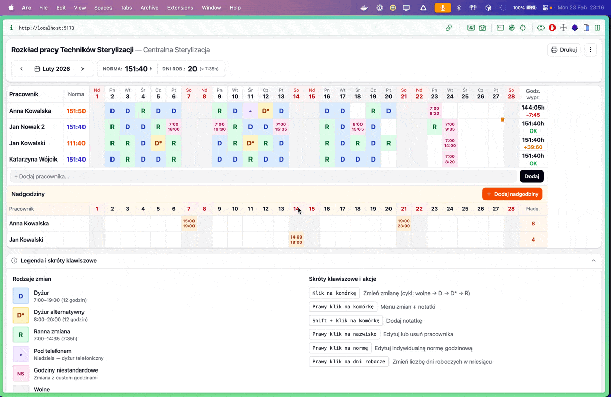

# Grafik Sterylizacja

A shift scheduling app for managing monthly work schedules of sterilization technicians (Centralna Sterylizacja). Built as a lightweight, offline-first single-page application.


## Features

- **4 shift types** with color coding — Dyżur (D), Dyżur alternatywny (D\*), Ranna (R), Pod telefonem (•), plus custom time ranges
- **Click-to-cycle** shifts (wolne → D → D\* → R) or right-click for full context menu
- **Overtime tracking** — separate section for recording extra hours per employee per day
- **Notes & requests** — attach notes to any cell (e.g. vacation, training)
- **Monthly norm validation** — auto-calculates working hours vs. expected norm (days × 7:35h), with per-employee overrides
- **Print-ready** — generates a landscape-optimized print layout with legend
- **JSON export/import** — backup and restore schedule data
- **Offline-first** — all data stored in localStorage, no server required
- **Single-file build** — production build outputs a single `index.html` (~280 KB)

### Header & Navigation


Navigate between months, view the monthly norm, and adjust working days. Print or export via the toolbar.

### Shift Cycling

Click any cell to cycle through shift types:


### Context Menu

Right-click any cell to assign shifts, add custom time ranges, or manage notes:


### Edit Employee Name

Right-click an employee name to rename or remove them:


### Edit Norm

Right-click the norm cell to set a custom monthly hour target per employee:


### Month Navigation

Navigate between months using the arrow buttons:


### Export Menu

Export/import schedule data as JSON, or view the raw JSON for manual editing:



### Legend & Keyboard Shortcuts


## Tech Stack

- **React** 19 — UI
- **Vite** 7 — build tool & dev server
- **Tailwind CSS** 4 — styling
- **vite-plugin-singlefile** — bundles everything into one HTML file

No external UI libraries, backend, or database. Pure client-side React + localStorage.

## Getting Started

### Prerequisites

- Node.js 18+
- npm

### Install

```bash
git clone <repo-url>
cd grafik-sterylizacja
npm install
```

### Development

```bash
npm run dev
```

Opens at `http://localhost:5173`.

### Production Build

```bash
npm run build
```

Outputs a single `dist/index.html` file that can be opened directly in a browser or hosted on any static server.

### Lint

```bash
npm run lint
```

## Data Storage

All data is persisted in the browser's `localStorage`:

| Key | Contents |
|-----|----------|
| `grafik-shared` | Employee list (persists across months) |
| `grafik-{YYYY}-{MM}` | Shifts, overtime, notes, norm overrides for a given month |
| `grafik-current` | Last viewed year/month |

## Project Structure

```
src/
  constants.js           Shift types, layout constants, month names
  utils.js               Time parsing, formatting, hour calculations
  context/
    ScheduleContext.jsx   React Context provider + useSchedule hook
  hooks/
    useScheduleData.js    Core CRUD operations for schedule data
    useMonthNavigation.js Month/year state + localStorage persistence
    useImportExport.js    JSON export/import logic
    useLocalStorage.js    Generic localStorage hook
    useContextMenu.js     Context menu positioning
    useToasts.js          Toast notification state
  components/
    ScheduleApp.jsx       Main app shell
    ScheduleHeader.jsx    Title, norm display, print button
    MonthNavigator.jsx    Month prev/next navigation
    ExportMenu.jsx        JSON export/import dropdown
    ShiftCell.jsx         Individual shift cell in the table
    OvertimeCell.jsx      Individual overtime cell
    OvertimeSection.jsx   Overtime rows section
    Legend.jsx            Shift legend + keyboard shortcuts
    Button.jsx            Reusable button with variants
    Modal.jsx             Reusable modal base (overlay, Esc, focus)
    Icons.jsx             All SVG icon components
    ...
  utils/
    printSchedule.js      Print layout generator
```
